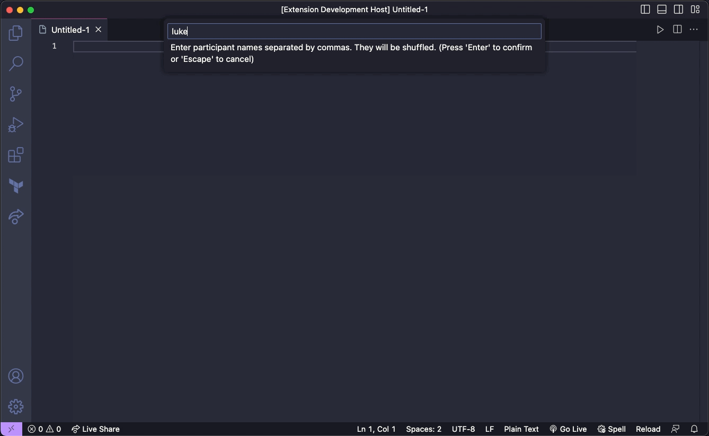

# Coding Dojo

The Coding Dojo Extension for Visual Studio Code is a simple, but powerful tool designed to facilitate and enhance coding dojo sessions. It provides a seamless and efficient way to manage participant lists, rotation, and timer functionality, ensuring smooth and productive coding sessions.

## Features

* **Participant List Management**: Easily create and manage a list of participants for your coding dojo sessions. The initially provided list will be shuffled for the session.
* **Rotation Management**: At the end of each turn, the rotation will occur automatically, but it is also possible for the facilitator to perform the rotation.
* **Timer Functionality**: Choose the time for each turn and see the timer running in the status bar. While the timer is stopped, the bar will be highlighted in color.

## Installation
* Launch Visual Studio Code.
* Open the Extensions view by clicking on the square icon on the left sidebar or pressing **Ctrl+Shift+X** or **⌘+Shift+X**.
* Search for "Coding Dojo" in the extensions marketplace.
* Locate the "Coding Dojo" extension by author "Paulo Cândido" and click on the "Install" button.
* After installation, the extension will be ready to use.

## Usage
* Open a workspace or folder where you want to manage your coding dojo session.
* Open the command palette (**Ctrl+Shift+P** or **⌘+Shift+P**) and select `Dojo: Start coding dojo`.
* Provide the participant list, separated by a comma, e.g. `Luke, Leia, Han`.
* Provide the time for each turn, e.g. `5`.
* Check status bar, current pair and a timer should be displayed.
* Click on the timer to start or stop it.
* Check other commands on the command palette (**Ctrl+Shift+P** or **⌘+Shift+P**) prefixed by `Dojo: `
* Enjoy the session!

## Feedback
Your feedback is valuable in improving the Coding Dojo Extension. If you encounter any issues, have suggestions for enhancements, or want to contribute to the project, please visit the GitHub repository and create a new issue.

Author: Paulo Cândido

## License
This extension is licensed under the MIT License.

---
__Happy coding and enjoy your coding dojo sessions with the Coding Dojo extension for Visual Studio Code!__